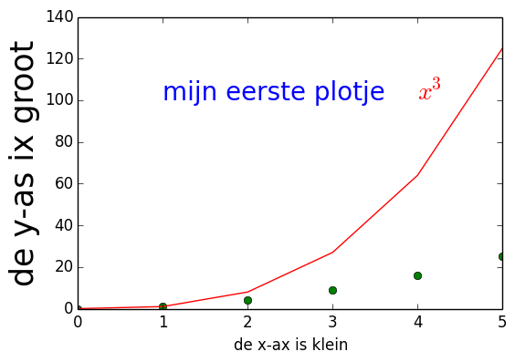
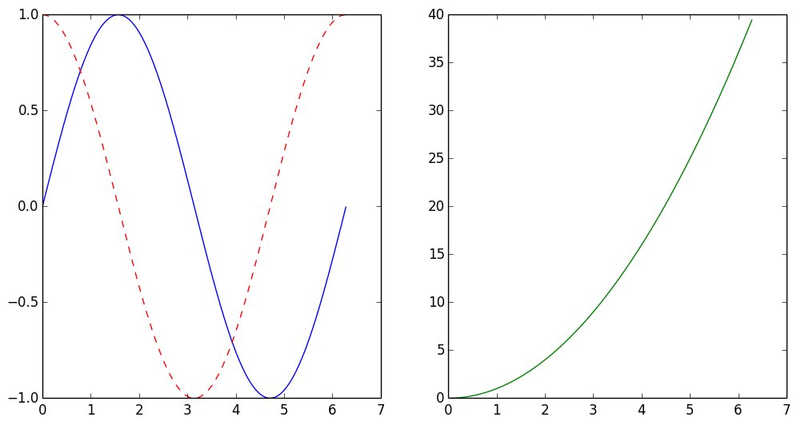

# Graphs

It is useful to visualize your results in a graph or even a video. Not only is it important for making the results of a project understandable, but also to better comprehend your data while writing your code. There is a standard library to visualize data in Python: `matplotlib`. It is a very expansive library of which we only need to utilize a tiny fraction.

> To effectively convey your message and conclusions it is important to spend some thought into presenting your information so your audience understands it all. There is an enormous variation in ways to visualize data and results. Always think carefully about how best to present your data so that the "user" comes to the right conclusions. Subsequently comb through the `matplotlib` documentation to find out how to implement the visualization that you envisioned.

## A list with datapoints

Let's start by plotting some points with the following x-values $$(0,1,2,3,4,5)$$ and y-values $$(0,1,4,9,16,25)$$. In this case, we plot the function $$x^2$$ exactly, but that is not necessarily true. To make a graph we need the following code:

    import matplotlib.pyplot

    # the coordinates per point
    x_coords = [0, 1, 2, 3, 4, 5]
    y_coords = [0, 1, 4, 9, 16, 25]

    # plot points (y to x) with green circles
    matplotlib.pyplot.plot(x_coords, y_coords, 'go')
    matplotlib.pyplot.show()
    matplotlib.pyplot.savefig('plot.png')

We choose green circles as 'markers', with which each point in the graph is represented: that is what `'go'` means (`g` green `o` circles). The final command saves the plot to a file called `plot.png`. This file is found as a separate file next to your code.

## Abbreviating

You can rename a module as you import it, so it has a more functional shorter name. In case of `matplotlib.pyplot` you can really effectively shorten your commands by naming it `plt`:

    # use abbreviation 'plt'
    import matplotlib.pyplot as plt

    # the coordinates per point
    x_coords = [0, 1, 2, 3, 4, 5]
    y_coords = [0, 1, 4, 9, 16, 25]

    plt.plot(x_coords, y_coords, 'go')
    plt.show()

## Multiple graphs and annotations

We'll expand the plot a little now: another function is added $$x^3$$, for which we use a line graph. We'll also add some axes labels and a separate text-annotation:

    import matplotlib.pyplot as plt

    x_values  = [0, 1, 2, 3, 4, 5]
    x_squared = [0, 1, 4, 9, 16, 25]
    x_cubed   = [0, 1, 8, 27, 64, 125]

    # note: a graph with two data sets: x_squared and x_cubed
    plt.plot(x_values, x_squared, 'go', x_values, x_cubed, 'r-')

    # add labels to the axes
    plt.xlabel('the x-as is small')
    plt.ylabel('the y-as is large', fontsize = 25)

    # add separate floating text to the graph
    plt.text(1.00, 100., "my first plot", color = 'blue', fontsize = 20)

    # add floating text with LaTeX
    plt.text(4.00, 100., "$x^3$", color = 'red', fontsize = 20)

    plt.show()

> Tip: the formula $$x^3$$ can be printed next to the graph. The formula `x^3` in the code above is written in the language $$\LaTeX$$.

## Higher resolution

Earlier we chose a small number of points where the values had to be filled in by hand. The graph is consequently a bit crude. To get a more fine-grained graph we can have the computer calculate a lot more y-values. If, for instance, we'd like to plot the function $$sin(x)$$ in steps of $$0.01$$ between $$0$$ and $$2\pi$$ then we can combine the different elements we've used before, like so:

    import numpy as np
    import math
    import matplotlib.pyplot as plt

    x_values = []
    y_values = []

    # x goes from 0 to 2pi in steps of 0.01
    for x in np.arange(0, 2 * math.pi, 0.01):
        # calculate the corresponding y-value for each x
        y = math.sin(x)

        # store the data in a list
        x_values.append(x)
        y_values.append(y)

    # plot the whole graph
    plt.plot(x_values, y_values, 'b-')
    plt.xlabel('x', fontsize = 20)
    plt.ylabel('sin(x)', fontsize = 20)
    plt.text(4.00, 0.50, "f(x) = sin(x)", color = 'black', fontsize = 20)
    plt.show()

## Graphs side by side

Finally, we'll look at how to plot two graphs side by side. You can use this example when asked to plot both the speed and the position of an object _as a function of time_. Each has a particular scale, which makes it clearer when plotted separately instead of in one and the same graph.

> Note: When one says plotting "A as a function of B", you can read it as plotting A on the vertical axis, and B as the horizontal axis.

By way of example we'll plot both the sine and the cosine, and in a graph beside it, we'll plot both $$x$$ and $$x^2$$.

This is the corresponding code:

    import math
    import numpy as np
    import matplotlib.pyplot as plt

    l_x    = []
    l_x2   = []
    l_sinx = []
    l_cosx = []

    for x in np.arange(0., 2 * math.pi, 0.01):
        l_x.append(x)
        l_x2.append(x*x)
        l_sinx.append(math.sin(x))
        l_cosx.append(math.cos(x))

    # common figure (contains both sub-figures)
    plt.figure(1)

    plt.subplot(121)  # go to subplot 1
    plt.plot(l_x, l_sinx, 'b-', l_x, l_cosx, 'r--')

    plt.subplot(122)  # go to subplot 2
    plt.plot(l_x, l_x2, 'g-')

    # show both graphs on the screen
    plt.show()
